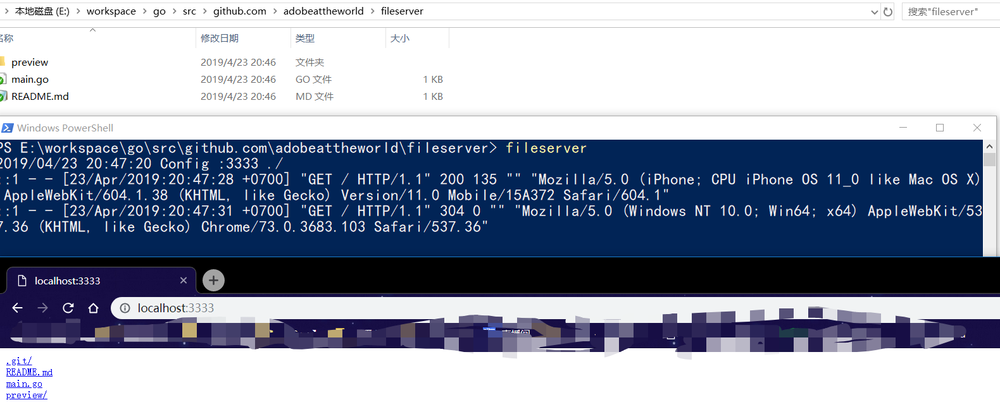
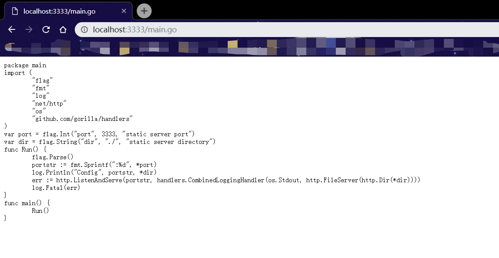

# Fileserver

本地文件服务器，用于在局域网共享文件预览

## 使用方式

- 通过  *go get -u github.com/adobeattheworld/fileserver* 安装

- 到想要暴露出去的文件夹中打开命令行

- 运行如下命令

  ```shell
  fileserver
  ```

## 预览







## 注意

需要把 *${GOPATH/bin}* 设置到系统环境变量，否则会报错找不到 fileserver 。


## 支持

理论上还支持Linux,MacOS，因为得益于golang的特性，可以打包到任意平台使用。

## 想法来源

[静态文件服务](https://www.cnblogs.com/adoontheway/p/8288295.html)

## README in English

[README](./README.md)
